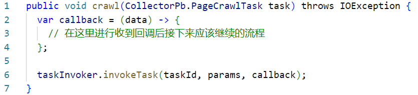
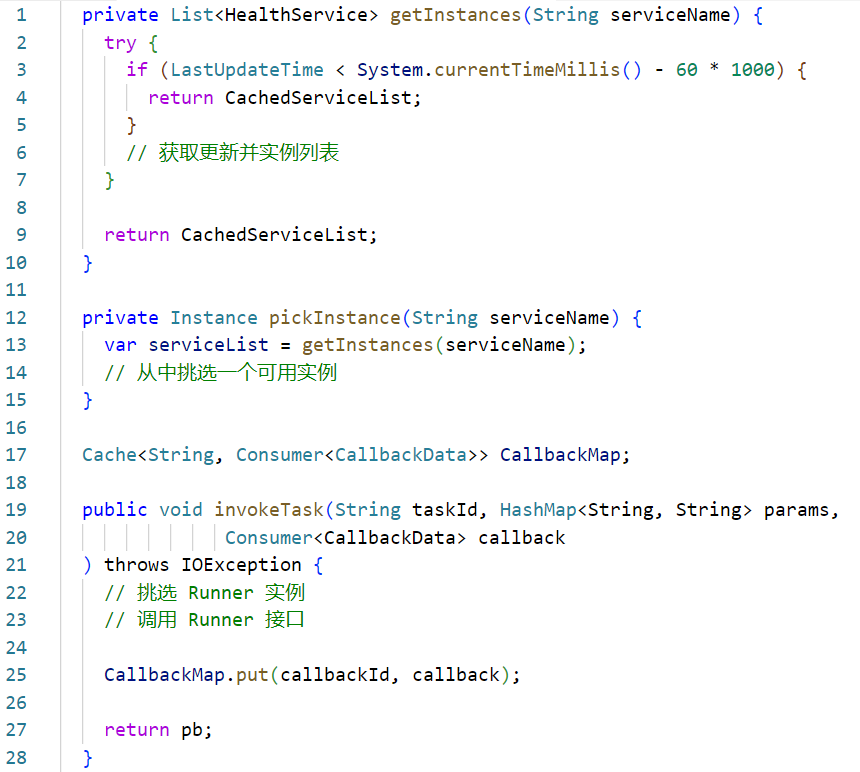
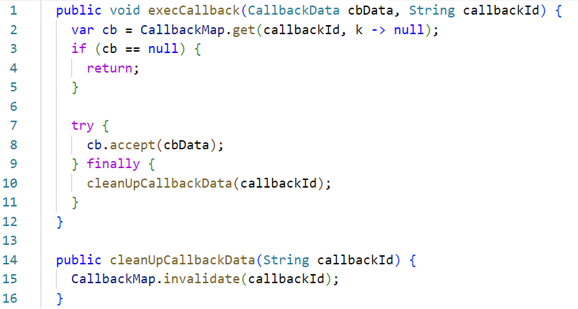
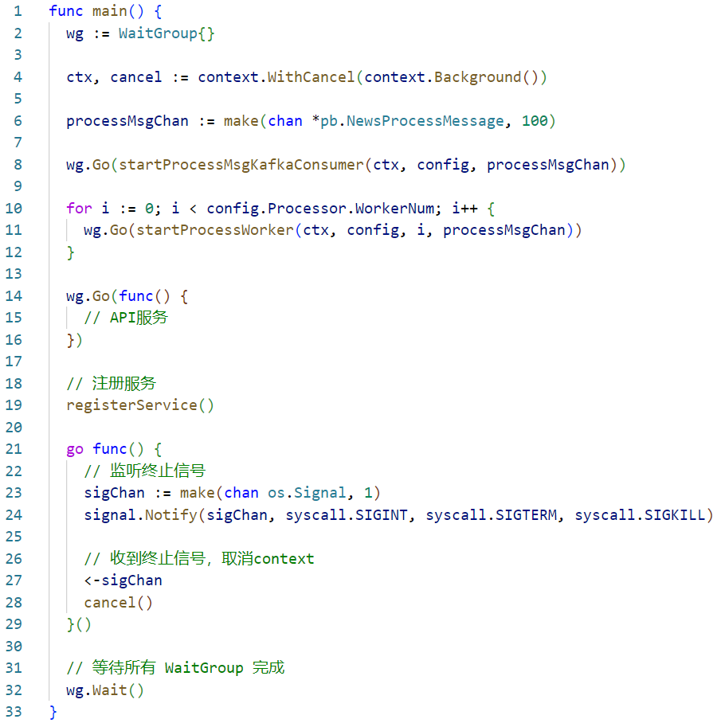
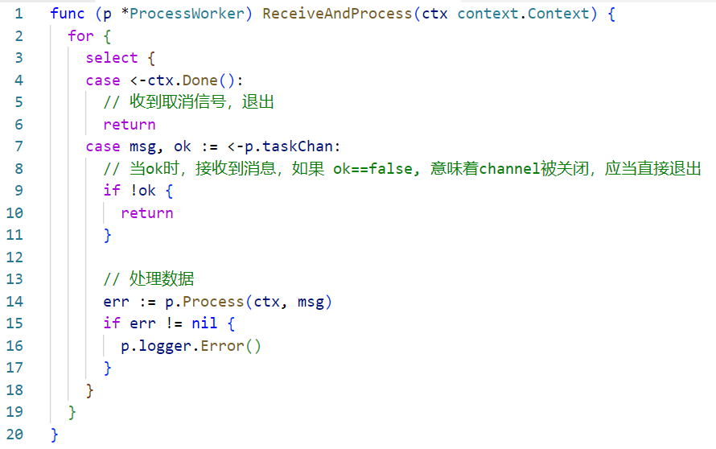
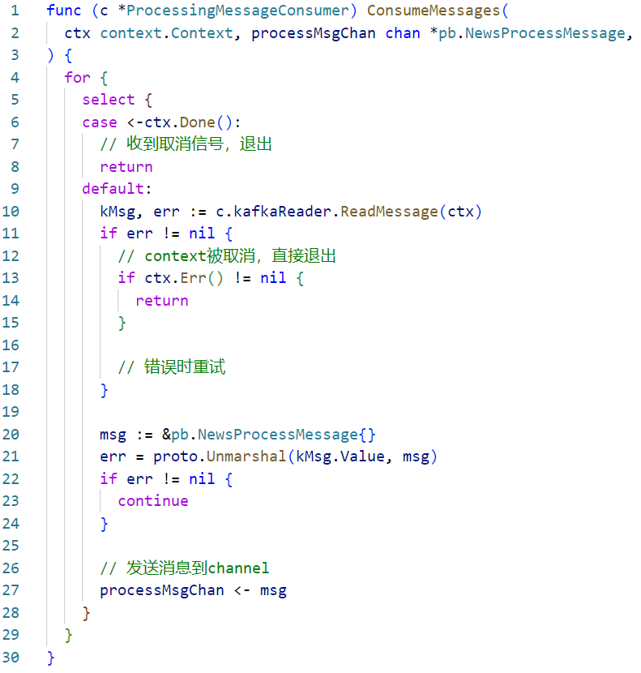
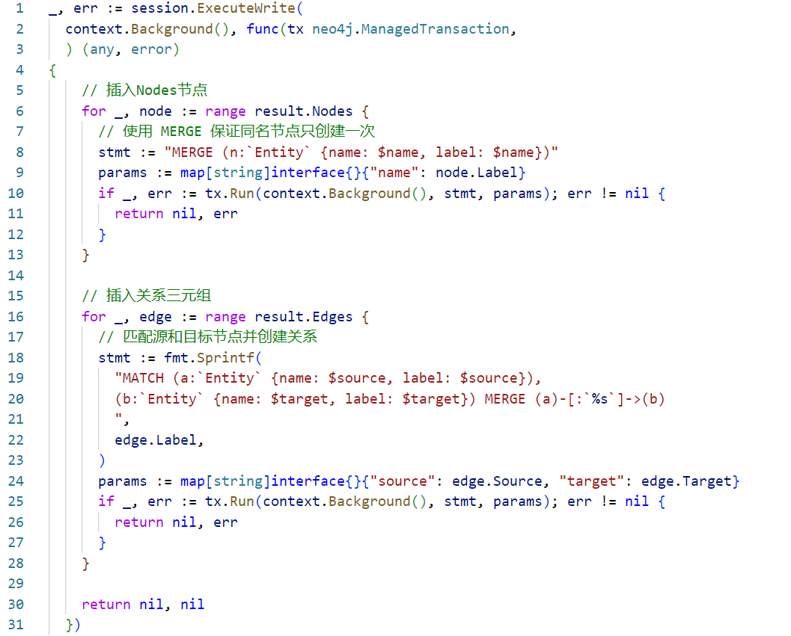

# pjcait 文档

这是一个用于从新闻中进行知识抽取的程序合集，分为几个：新闻更新与处理（包括爬虫），现有数据处理。

使用到的组件与建议的版本：

- Mysql: 8+
- redis
- kafka 3.8.0
- elasticsearch 8.14.3 (8.x)
- neo4j 2025.5

~~实在是不想写文档了，随便写一些吧，有其他问题的话直接问就可以~~

目录：

<!-- TOC -->

- [pjcait 文档](#pjcait-%E6%96%87%E6%A1%A3)
    - [① 新闻更新与处理](#%E2%91%A0-%E6%96%B0%E9%97%BB%E6%9B%B4%E6%96%B0%E4%B8%8E%E5%A4%84%E7%90%86)
      - [任务模块](#%E4%BB%BB%E5%8A%A1%E6%A8%A1%E5%9D%97)
      - [数据采集模块](#%E6%95%B0%E6%8D%AE%E9%87%87%E9%9B%86%E6%A8%A1%E5%9D%97)
      - [信息抽取模块](#%E4%BF%A1%E6%81%AF%E6%8A%BD%E5%8F%96%E6%A8%A1%E5%9D%97)
      - [数据存储模块](#%E6%95%B0%E6%8D%AE%E5%AD%98%E5%82%A8%E6%A8%A1%E5%9D%97)
    - [② 从现有新闻处理的程序](#%E2%91%A1-%E4%BB%8E%E7%8E%B0%E6%9C%89%E6%96%B0%E9%97%BB%E5%A4%84%E7%90%86%E7%9A%84%E7%A8%8B%E5%BA%8F)
    - [③ 自己写的爬虫](#%E2%91%A2-%E8%87%AA%E5%B7%B1%E5%86%99%E7%9A%84%E7%88%AC%E8%99%AB)

<!-- /TOC -->

### ① 新闻更新与处理

> 这部分实际上是个毕设，~~实际上的核心功能实现上很简单，因为需要一定的工作量，因此上了一堆东西~~。
> 
> 设计部分懒得再讲一遍了，下面的内容基本上都是从论文里边直接摘下来的~~废话~~，只有一点删改，不想看可以直接喂给AI总结。
> 
> 代码为什么不用代码块？因为不想再粘贴一遍了，直接把文里的图拉来了。

系统整体的结构设计：


系统主要由以下模块服务组成：任务模块、数据采集模块，信息抽取处理模块，数据存储模块。

项目中使用的开发语言主要有Java、Go、Python。

在任务和数据收集模块中，主要使用 Java 作为开发语言，数据处理模块使用 Go 开发，Python主要用于爬虫编写和LLM运行

各个模块主要功能设计如下：

#### 任务模块（collector）

主要负责从预定义好的数据源中定时拉取更新新闻数据，也可以通过自定义数据源。根据定时配置，定时从数据源获取到新闻索引后，下发数据收集任务，将数据收集交由收集模块执行；同时还提供了外部 API 接口，以便操作定时任务的启停。
 
#### 数据采集模块（collector）

数据采集模块主要负责接收来自任务模块下发的任务信息，并根据任务中指定的执行方式，将任务路由到相应的数据采集组件中去。该模块支持多种不同类型的数据抓取器，能够灵活应对各种数据来源和数据格式。

在执行过程中数据采集模块首先解析任务配置，明确任务所需的数据源类型、字段参数及存储方式等参数。随后根据这些参数，将任务交由对应的抓取器去执行。系统中有内置的通用抓取器（SeleniumCrawler，RawHTMLCrawler），也提供了自定义的抓取器实现，通过约定统一的外部调用格式，通过配置即可添加。

此外，对于一些无法通过网络获取的数据来源，例如部分纸质报纸等，系统也提供了手动输入的解决方式输入数据进行处理。通过提供 API 接口，用户可以通过图形化面板，直接输入这些内容，数据采集模块会立即将这些数据按照配置的存储方式存档，并在需要时发布处理任务。

数据采集模块的结构设计如图3.2所示，展示了模块各个单元之间的交互关系，各单元之间通过标准化的接口来实现数据的流转和控制，以此来保证整个模块运行的高效性与稳定性。

> PS：实际上『任务模块』和『数据采集模块』是同一个程序，只是不同的部分
> 
> 另外，虽然说可以用Easyspider，但是实际上用起来一点都不Easy，一些方案的自由度很低，还不如直接手写页面元素抽取，反正我是没有用easyspider去实际实现爬虫，只是理论上在程序里面支持了这种办法，不是很建议用这玩意

下面是自定义的抓取接口说明：


在数据收集模块中，回调是通过缓存相应的回调方法函数接口来完成的。



crawl方法是抓取器的入口，核心工作是发起一个异步任务调用，创建一个回调函数 callback，接收一个 data（类型为 CallbackData）作为参数。然后通过 taskInvoker.invokeTask(...) 发起任务调用，同时注册该回调函数。后续的处理流程由回调函数来处理。



在 taskInvoker.invokeTask 中，先通过调用 pickInstance 方法来获取到一个 Runner 实例，同时getInstances方法会判断更新实例列表，接着invokeTask方法发起 Runner 调用，并将回调 callback 缓存至一个 LRU 缓存中。这个缓存具有容量上限以及过期时间，当容量已满或者到达超时时间，最久的回调实例将会被清除，被认为是超时的任务。当 Runner 的执行请求发送完成后，此时 crawl 函数实际上已经结束，后续流程是交由当初生成的 callback 来处理的。
 


当任务处理完成，回调接口被执行时，在接口层会调用 execCallback 方法，并传入回调数据和 callbackId。在 execCallback 方法中，根据 callbackId，从缓存中取出回调的临时实例，并将回调数据传入并执行，以继续后续的流程处理，并清理回调缓存。

数据抓取完成后，这部分模块会将新闻文本存入相应的存储中，如 ElasticSearch 或者文件系统中，并向消息队列发送任务事件消息，通知数据处理部分对这些数据进行处理，完成后续的处理。

此外，数据收集部分还提供了直接的新闻数据输入，当调用这个接口时，能够直接将数据入库并生成任务消息。

#### 信息抽取模块（processor）

信息抽取模块是整个系统中非常重要的部分，其主要功能是通过对输入的新闻文本进行信息抽取，提取出其中的知识信息。

在信息抽取模块的设计中，各个部分通过数据管道进行通信，实现模块间数据的异步传输。消息队列消费者部分接收到处理任务的事件消息时，通过数据管道传递事件消息到负责数据处理的工作者 (process worker)，worker 接收到处理消息后，从指定的存储位置取出数据（Elasticsearch或数据湖），并请求模型进行知识的抽取，接着 worker 将提取出的知识信息通过另一个数据管道发送到存储部分，而数据处理部分在接收到消息后，将处理得到的结果存储到数据库中。

在设计上这部分的模块使用了可多节点弹性部署的设计。

数据处理这部分的模块主要是根据任务事件消息，从相应的存储取出数据，并对其进行数据抽取。

数据处理模块的程序结构使用了 1+1+n 的设计，意思是一个 API 协程（有别于线程），一个消息协程以及若干个 Worker 协程。

API 协程主要是负责接收健康检查的请求以及一些状态监控。

消息协程负责的是从消息队列中拉取并转换消息，而 Worker 协程则是实际负责数据处理的协程，通过开启多个协程来提高单节点的处理能力。

这些部分的通信都是通过 Go 中的 channel 和 Context 机制来进行通信和控制的。当消息协程接收到处理事件消息时，反序列化 protobuf 数据为 Go 中的数据结构体，通过 channel 将待处理的信息发送到其中一个 Worker，以便其开始处理，在没有消息时会一直从消息队列等待接收消息，直到收到消息或者 Context 被取消。在程序中有数个 Worker 同时消费这一个 channel，但当有数据时只有一个 Worker 能够收到数据，channel 其实也是类似一个队列。在没有数据时，Worker 会阻塞在等待 channel 数据，或者直到 Context 被取消。在主函数中，每个协程都会分配一个 WaitGroup，在主线程会一直等待 WaitGroup 全部结束，以避免主线程执行完毕导致程序直接退出。同时在主线程还会接收系统信号，当接收到 syscall.SIGINT, syscall.SIGTERM, syscall.SIGKILL 这三类退出信号时（如在命令行中输入 Ctrl+C 退出程序），将会取消 Context，将所有的Worker和消息接收器结束，此时 WaitGroup 也将会结束，此时主线程便能够“优雅”退出。



主程序部分启动了几个协程，启动相关协程并注册服务到注册中心，一个Kafka消费者协程(startProcessMsgKafkaConsumer)，一个用于提供API服务的协程，还有若干个工作协程 (startProcessWorker)。Kafka消费者协程从消息队列中读取消息，并将消息发送到 processMsgChan 管道。工作协程根据配置 (config.Processor.WorkerNum) 会被启动多个进行处理 (startProcessWorker)，从  processMsgChan 接收消息并进行处理，但同一个消息只有一个 worker 负责处理。
同时通过context机制实现优雅关闭：程序监听操作系统的终止信号（如 SIGINT, SIGTERM）。一旦接收到终止信号，会调用 cancel() 函数取消 context，从而通知所有依赖此 context 的协程进行清理和退出。同时在此处使用 sync.WaitGroup 等待所有启动的协程任务完成，确保程序在所有工作完成后才退出。
 


worker负责接收并处理数据部分是Worker中负责从 channel 管道中接收并执行数据处理的部分。这部分在一个无限循环中持续监听两个事件：
1. 上下文取消信号：通过 <-ctx.Done() 监听 context.Context 的取消信号。一旦 context 被取消（如ctx的 cancel() 函数被执行），会落到此分支，此时函数立即返回，从而实现协程的优雅退出。
2. 任务消息：通过 msg, ok := <-p.taskChan 从 p.taskChan 管道接收 pb.NewsProcessMessage 类型的消息，当有消息时或者 channel 管道被关闭时，将会落到此分支。如果成功接收到消息 (ok 为 true)，会调用 p.Process(ctx, msg) 方法对消息进行实际处理，并记录可能发生的错误，如果 p.taskChan 被关闭 (ok 为 false)，这表明没有更多消息会到来，该方法也会返回，退出循环。
 


消息消费者部分是负责处理相关信号的部分。在一个无限循环中，持续从Kafka读取消息并将其发送到处理通道：
1. 上下文取消信号：通过 <-ctx.Done() 监听 context.Context 的取消信号。一旦 context 被取消（如ctx的 cancel() 函数被执行），会落到此分支，此时函数立即返回，从而实现协程的优雅退出。
2. 读取Kafka消息：如果没有取消信号，代码会尝试调用 c.kafkaReader.ReadMessage(ctx) 从Kafka读取一条消息。当没有消息时，会一直停留在此。如果读取过程中发生错误，检查 ctx.Err() != nil 来判断是否是 context 被取消导致的错误，如果是则直接退出，否则（隐式地）重试读取。成功读取到Kafka消息后，将消息的 Value 字段使用 proto.Unmarshal 反序列化为 pb.NewsProcessMessage 结构体。如果反序列化失败，则跳过当前消息。最后将解析后的 pb.NewsProcessMessage 发送到 processMsgChan 管道，供下游的工作协程进行处理。

LLM 在处理任务时通常需要较长时间，特别是需要输出的结果较多时，使用同步的请求方式会很容易出现请求处理超时而失败的问题。为了解决这个问题，在数据处理模块的模型请求部分使用的是流式接口进行通信，这种接口能够实现 LLM 后端在计算推理过程每计算出一部分结果时（通常为一个或者数个 token 单元），就立即推送到客户端，而不是全部计算完毕才返回结果。流式的网络传输通常会直接使用基于 TCP 的协议或者WebSocket（Web环境中），而直接 TCP的实现方式一是操作麻烦，二是数据传输方向在请求发出后就基本为单向的传输，TCP 的双向传输特性并没有明显的优势，因此在处理模块中与模型的通信使用的是服务端发送事件 (Server-Sent Events, SSE) 来实现流式数据的传输，这是一种允许服务器向客户端推送数据的技术，基于HTTP 协议，能够被大部分的 HTTP 客户端支持，在发出请求后保持长连接来实现服务端的实时和持续的数据推送。当 LLM 后端计算出下一个 token 时，直接推送到客户端上，数据处理模块通过 SSE 接收模型的逐步输出，在最后拼接出处理结果数据。

#### 数据存储模块（processor）

对抽取模块中提取出的知识信息，将其转换并保存至图数据库等进行存储，提供接口，供其他的系统使用和分析。

系统的各个功能整体围绕着一个中心化的消息队列进行构建。消息队列在系统中扮演着“数据总线”的角色，充当模块之间通信的桥梁和中介。通过这种方式来降低各个模块之间耦合度，提升系统整体的扩展性和维护性。各个模块通过向消息队列发送或订阅消息来实现数据的传递与处理，实现模块间的异步通信和协同工作，提高了系统的稳定性、可靠性以及可扩展性。

> PS：和上面一样，实际上『息抽取模块』和『数据存储模块』是同一个程序，只是不同的部分

数据存储模块其实和数据处理模块是在同一个程序中的，为了在逻辑设计上更加清晰和便于维护，进行了进一步的细化和模块化处理。从数据处理部分得到的经过模型抽取的信息是以 JSON 格式表示的。仅得到这些 JSON 结果是不够的，还需要将这些数据有效地存储下来，以便进行后续的使用（如为智能问答系统等提供 RAG 支持）。

为了将这些处理结果存储在图数据库中，构建一个完整且结构化的知识图谱，需要对上游得到的 JSON 形式的抽取结果进行进一步的转换和处理。在存储这类数据方面最擅长的为图数据库，而在图数据库中使用最广泛的为 Neo4j。系统采用 Neo4j 作为其图数据库存储平台，从模型中得到的 JSON 数据结果并不直接兼容这种图结构，因此还需要将 JSON 数据转换为Neo4j 使用的 Cypher 查询语言。Cypher 是 Neo4j 的一种声明式查询语言，用于查询和操作图数据库中的数据。为了实现数据的持久化存储，系统需要将每一个节点和关系都转换为对应的 Cypher 语句，并在图数据库中执行这些语句，从而构建出一个完整的知识图谱。
数据存储模块的实现过程大致如下图4.8所示：



结果转换部分通过 session.ExecuteWrite 方法在一个事务中完成下面的两种操作：
1. 插入节点 (Nodes)：遍历 result.Nodes 中的每个节点，使用 Cypher 语句 MERGE (n:Entity {name: $name, label: $name})插入。MERGE 语句保证节点的唯一性，避免重复创建。
2. 插入关系 (Edges)：遍历 result.Edges 中的每个关系。使用 MATCH 语句找到源节点和目标节点，然后使用 MERGE (a)-[:%s]->(b) 创建或匹配这些节点之间的关系。%s 会被关系的 Label 动态填充，表示关系的类型。这确保了如果关系已经存在，则不会重复创建。

### ② 从现有新闻处理的程序

这部分用的py写，主要是对之前收集的新闻数据进行处理，进行抽取，然后存到neo4j里。

代码在`graph-builder`里。关于运行环境，我用的是uv来配置的，相关依赖信息都在里边的`pyproject.toml`文件。至于uv怎么用，自己找资料看。当然也不是非要用uv，自己装上这些依赖就行。

依赖参考。

python>=3.12

```
beautifulsoup4>=4.13.4
elasticsearch<9.0.0
flask==3.1.1
langchain>=0.3.25
langchain-experimental>=0.3.4
langchain-neo4j>=0.4.0
langchain-openai>=0.3.19
neo4j>=5.28.1
pandas>=2.3.0
```

`parallel_builder.py`是并行处理的处理器，负责从csv文件里读入数据然后发给LLM处理，并存入neo4j中。

那几个main和builder的py文件是不同时候写的几个版本，懒得写注释了，不想看的话喂给AI看吧

里边的api密钥是我的，请自己改成自己的。

### ③ 自己写的爬虫

爬虫在`crawler`里。数据源有两个，一个是哈萨克国际通讯社讯，一个是中国驻哈萨克斯坦共和国大使馆经济商务处的网站。

依赖的安装同上，也是用的uv，你也可以自己安装。

python>=3.12

```
beautifulsoup4==4.13.4
drissionpage==4.1.0.18
elasticsearch<9.0.0
flask==3.1.1
python-consul>=1.1.0
tqdm>=4.67.1
```

主要是用的drissionpage来操作一个浏览器，对页面进行元素提取来拿到新闻数据。

抓取到的数据流的工作流程见上文数据收集部分，可以去看代码了解。
